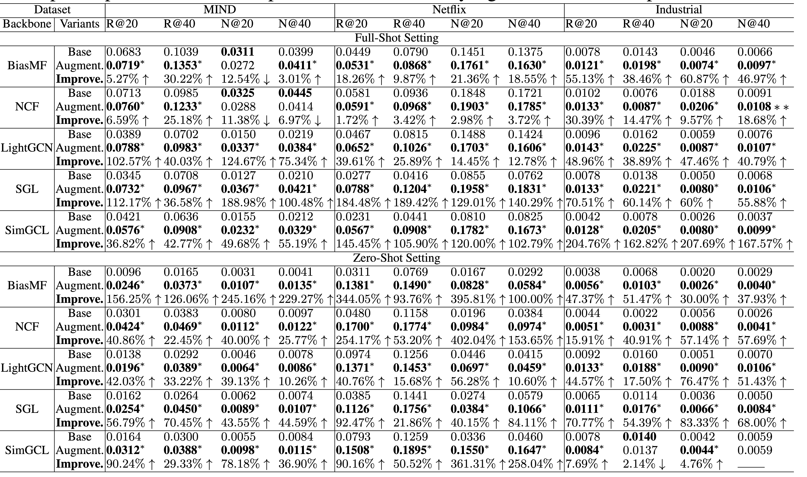

# RecLM: Recommendation Instruction Tuning


This is the codes and dataset for **RecLM** proposed in the paper **RecLM: Recommendation Instruction Tuning**.

### Introduction

In this work, the authors introduce a model-agnostic instruction tuning framework RecLM. It can be seamlessly integrated into existing recommendation systems as a plug-and-play component, significantly enhancing their generalization capacity in scenarios with limited data. The authors integrate large language models with collaborative filtering to enhance user profiling, particularly in cold-start scenarios, where current methods often struggle. Additionally, this approach employs reinforcement learning to refine profile quality, effectively addressing challenges associated with data noise and over-smoothing. In order to conduct comprehensive evaluation, the authors integrate RecLM with a range of state-of-the-art recommenders to assess the effectiveness of the proposed approach across various settings.


## 📝 Environment

For running base recommendation models:

- python==3.9.13

- numpy==1.23.1

- torch==1.11.0

- scipy==1.9.1

For tuning LLMs:

- wandb==0.16.2 

- transformers== 4.36.2

- trl==0.7.9

- peft==0.7.2

## 🚀 How to run the codes

**1. Tuning Llama 2 via Lora.**

```
cd ./llm/lora/
```

For conducting LLM fine-tuning through knowledge distillation (user side):

```
python sft_base.py
```

For conducting collaborative instruction tuning (user side):

```
python sft_base_mask.py
```

For conducting reinforcement learning-based personalized feature enhancement (user side).

```
cd ./rlhf/
```

- Training the reward model:

```
python reward_modeling.py
```

- Proximal policy optimization:

```
python rl_training.py
```

For conducting collaborative instruction tuning (item side):

```
python sft_base_item.py
```

**2. User/Item profile generation.**

- User profile generation (only knowledge distillation)

```
python inference_base.py
```

- User profile generation (with collaborative instrucntion tuning and reinforcement learning enhancement)

```
python inference_base_mask.py
```

- Item profile generation

```
python inference_base_item.py
```

**Note**: We provide the llama weights that have undergone collaborative instruction tuning and reinforcement learning enhancement on the MIND and Netflix datasets in the Hugging Face repository (https://huggingface.co/hkuds/RecLM_model). Please download the corresponding model weight files before performing profile inference.

**3. Running base recommendation models integrated with generated user/item profiles.**

For running base recommendation models (e.g., BiasMF):

```python
cd ./base_models/BiasMF/
python Main.py --data {dataset}
```

## 🎯 Experimental Results

**Performance comparison on MIND, Netflix and Industrial data in terms of *Recall* and *NDCG*:**



## 📚 Datasets

**Statistics of the experimental datasets:**

| Statistics       | MIND    | Netflix | Industrial |
| ---------------- | ------- | ------- | ---------- |
| # User           | 57128   | 16835   | 117433     |
| # Overlap. Item  | 1020    | 6232    | 72417      |
| # Snapshot       | daily   | yearly  | daily      |
| **Training Set** |         |         |            |
| # Item           | 2386    | 6532    | 152069     |
| # Interactions   | 89734   | 1655395 | 858087     |
| # Sparsity       | 99.934% | 98.495% | 99.995%    |
| **Test Set**     |         |         |            |
| # Item           | 2461    | 8413    | 158155     |
| # Interactions   | 87974   | 1307051 | 876415     |
| # Sparsity       | 99.937% | 99.077% | 99.995%    |

## 👉 Code Structure

```
.
├── README.md
├── TextEncoder.py
├── base_models
│   ├── BiasMF
│   │   ├── DataHandler.py
│   │   ├── Main.py
│   │   ├── Model.py
│   │   ├── Params.py
│   │   └── Utils
│   │       ├── TimeLogger.py
│   │       └── Utils.py
│   ├── LightGCN
│   │   ├── DataHandler.py
│   │   ├── Main.py
│   │   ├── Model.py
│   │   ├── Params.py
│   │   └── Utils
│   │       ├── TimeLogger.py
│   │       └── Utils.py
│   ├── NCF
│   │   ├── DataHandler.py
│   │   ├── Main.py
│   │   ├── Model.py
│   │   ├── Params.py
│   │   └── Utils
│   │       ├── TimeLogger.py
│   │       └── Utils.py
│   ├── SGL
│   │   ├── DataHandler.py
│   │   ├── Main.py
│   │   ├── Model.py
│   │   ├── Params.py
│   │   └── Utils
│   │       ├── TimeLogger.py
│   │       └── Utils.py
│   └── SimGCL
│       ├── DataHandler.py
│       ├── Main.py
│       ├── Model.py
│       ├── Params.py
│       └── Utils
│           ├── TimeLogger.py
│           └── Utils.py
├── data
│   ├── README.md
│   ├── mind
│   │   ├── gpt_output_dict_item_side_filter.pkl
│   │   ├── item_id_map_test.pkl
│   │   ├── item_id_map_train.pkl
│   │   ├── item_id_map_zero.pkl
│   │   ├── item_info_dict.pkl
│   │   ├── item_original_features.npy
│   │   ├── item_profile
│   │   │   └── item_profile_embeddings.npy
│   │   ├── maskMat_zero.pkl
│   │   ├── self_instruction_dict.pkl
│   │   ├── self_instruction_dict_item.pkl
│   │   ├── trnMat_zero.pkl
│   │   ├── tstMat_zero_.pkl
│   │   ├── tstMat_zero_shot.pkl
│   │   ├── user_item_dict_test.pkl
│   │   ├── user_item_dict_train.pkl
│   │   └── user_profile
│   └── netflix
│       ├── gpt_output_dict_item_side_filter.pkl
│       ├── item_id_map_test.pkl
│       ├── item_id_map_train.pkl
│       ├── item_id_map_zero.pkl
│       ├── item_info_dict.pkl
│       ├── item_original_features.npy
│       ├── item_profile
│       │   └── item_profile_embeddings.npy
│       ├── maskMat_zero.pkl
│       ├── self_instruction_dict.pkl
│       ├── self_instruction_dict_item.pkl
│       ├── self_instruction_dict_item_full.pkl
│       ├── trnMat_zero.pkl
│       ├── tstMat_zero_.pkl
│       ├── tstMat_zero_shot.pkl
│       ├── user_item_dict_test.pkl
│       ├── user_item_dict_train.pkl
│       └── user_profile
│           └── user_profile_embeddings.npy.zip
├── figures
│   ├── RecLM_fig.png
│   ├── exp.png
│   └── model.png
├── llm
│   ├── ft_models
│   │   └── README.md
│   └── lora
│       ├── convert_llama_weights_to_hf.py
│       ├── inference_base.py
│       ├── inference_base_item.py
│       ├── inference_base_mask.py
│       ├── make_dataset.py
│       ├── merge_model.py
│       ├── rlhf
│       │   ├── accuracy.py
│       │   ├── reward_modeling.py
│       │   └── rl_training.py
│       ├── sft_base.py
│       ├── sft_base_item.py
│       ├── sft_base_mask.py
│       └── sft_base_naive.py
└── sft_data
    ├── mind
    │   ├── cf_instruction_data.csv
    │   ├── cf_instruction_hf
    │   │   ├── data-00000-of-00001.arrow
    │   │   ├── dataset_info.json
    │   │   └── state.json
    │   ├── item_side_instruction_data.csv
    │   ├── item_side_instruction_hf
    │   │   ├── data-00000-of-00001.arrow
    │   │   ├── dataset_info.json
    │   │   └── state.json
    │   ├── mind_fine_tune.csv
    │   ├── mind_hf
    │   │   ├── data-00000-of-00001.arrow
    │   │   ├── dataset_info.json
    │   │   └── state.json
    │   └── rlhf
    │       ├── eval.csv
    │       ├── rl.csv
    │       └── train.csv
    └── netflix
        ├── cf_instruction_data.csv
        ├── cf_instruction_hf
        │   ├── data-00000-of-00001.arrow
        │   ├── dataset_info.json
        │   └── state.json
        ├── item_side_instruction_data.csv
        ├── item_side_instruction_hf
        │   ├── data-00000-of-00001.arrow
        │   ├── dataset_info.json
        │   └── state.json
        ├── netflix_fine_tune.csv
        ├── netflix_hf
        │   ├── data-00000-of-00001.arrow
        │   ├── dataset_info.json
        │   └── state.json
        └── rlhf
            ├── eval.csv
            ├── rl.csv
            └── train.csv
```

## 🌟 Citation

If you find this work helpful to your research, please kindly consider citing our paper.
